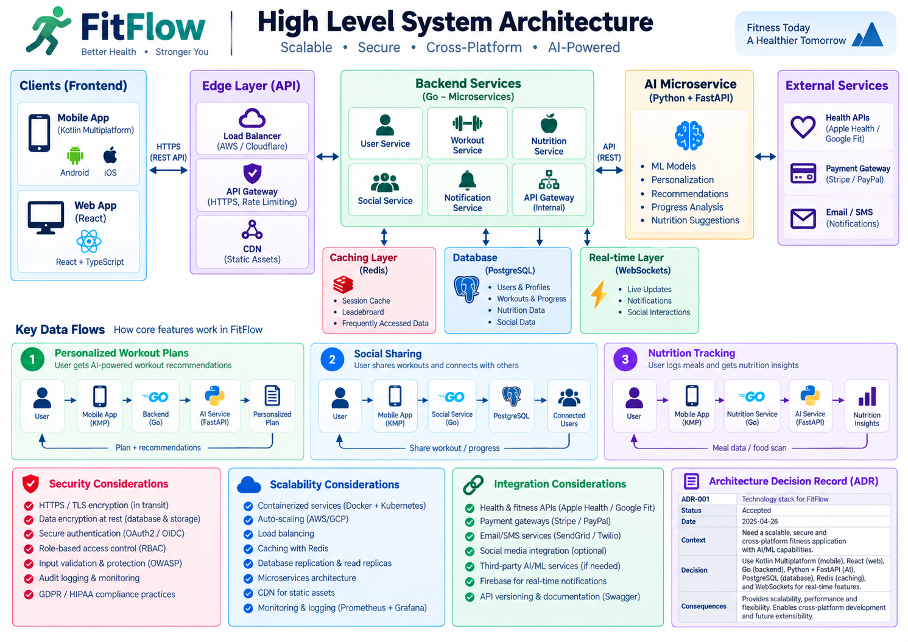

# High-Level Architecture

## Critical flows

### Personalized workout plan
Client -> Cognito -> Go Workout API -> PostgreSQL -> FastAPI AI -> PostgreSQL/Redis -> Client

### Social sharing
Client -> Go Social API -> PostgreSQL -> Redis/WebSocket -> Authorized users / push provider

### Nutrition tracking
Camera -> private object storage -> Go Nutrition API -> FastAPI vision -> user confirmation -> PostgreSQL -> Client

## Security

- OIDC/OAuth 2.0 with PKCE
- TLS in transit and encryption at rest
- JWT verification and least-privilege authorization
- Consent, export/deletion workflows and audit logging
- Secrets stored outside source control

## Scalability

- Stateless Go API instances behind a load balancer
- Independently scaled AI inference service
- PostgreSQL indexes/replicas where justified
- Redis cache for hot data
- WebSocket layer for connected clients
